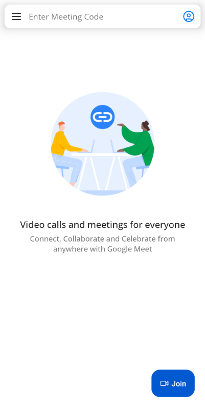
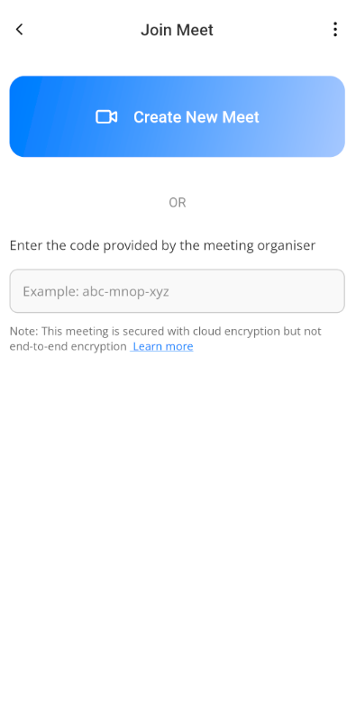
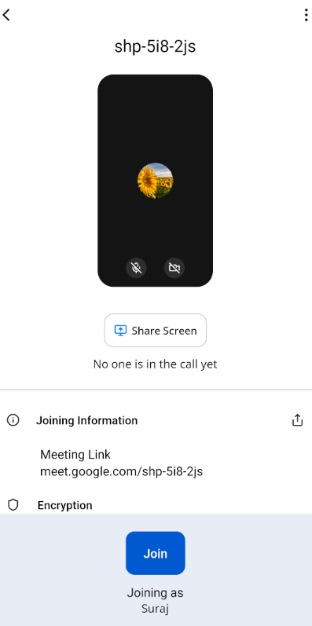
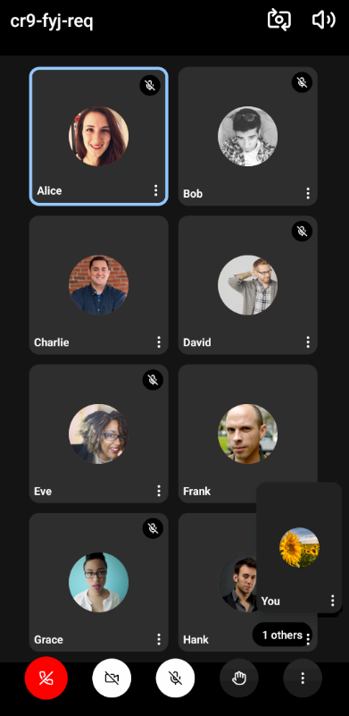
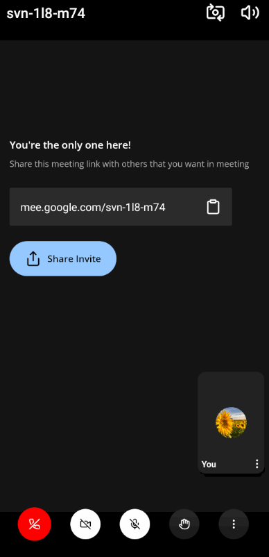

# Google Meet Clone App Project

## Overview

This project is a feature-rich video conferencing application inspired by Google Meet. It provides users with a seamless experience for virtual meetings, allowing them to connect, collaborate, and celebrate from anywhere.

### Project Screenshots

|  |  |  |  |  |
| :----------------------------------------------------------: | :---------------------------------------: | :---------------------------------------: | :---------------------------------------: | ----------------------------------------- |

## Features

- **Join or Create Meetings**: Users can create new meetings or join existing ones using a meeting code, ensuring easy accessibility.
- **User Interface**: A clean and intuitive UI, including:
  Input field for meeting codes.
  Prominent "Create New Meet" and "Join" buttons for a user-friendly experience.
- **Pre-Join Preview**: Before joining a call, users can:
  Check their audio and video settings.
  See the meeting link for easy sharing.
- **Real-Time Video Conferencing**:
  High-quality video and audio communication.
  Dynamic grid layout to view multiple participants.
- **Participant Management**:
  Display of participant names and profile pictures.
  Mute/unmute and video on/off controls for privacy.

## Technologies Used

- **Frontend**: React for a responsive and dynamic user interface.
- **Backend**: Node.js and Express.js for server-side operations and real-time communication.
- **Real-Time Communication**: Implemented using WebRTC and Socket.IO for smooth video calling and messaging.

# Steps for local set-up

## Step 1: Start Server

First, you will need to run **meet_server**, the backend server for our application.

to run the server, follow the instructions as:

- goto `https://cloud.mongodb.com/` and create a cluster
- now goto `meet_server` folder and add config file
- in config file mention

```shell
MONGO_URI = mongodb+srv://<USER_NAME>:<PASSWORD>@cluster0.jsksd.mongodb.net/google_meet?retryWrites=true&w=majority&appName=Cluster0
```

- now at the end execute

```sh
npm run start
```

## Step 2: Start Metro

First, you will need to run **Metro**, the JavaScript build tool for React Native.

To start the Metro dev server, run the following command from the root of your React Native project:

```sh
# Using npm
npm start

# OR using Yarn
yarn start
```

## Step 3: Build and run your app

With Metro running, open a new terminal window/pane from the root of your React Native project, and use one of the following commands to build and run your Android or iOS app:

### Android

```sh
# Using npm
npm run android

# OR using Yarn
yarn android
```

### iOS

For iOS, remember to install CocoaPods dependencies (this only needs to be run on first clone or after updating native deps).

The first time you create a new project, run the Ruby bundler to install CocoaPods itself:

```sh
bundle install
```

Then, and every time you update your native dependencies, run:

```sh
bundle exec pod install
```

For more information, please visit [CocoaPods Getting Started guide](https://guides.cocoapods.org/using/getting-started.html).

```sh
# Using npm
npm run ios

# OR using Yarn
yarn ios
```

If everything is set up correctly, you should see your new app running in the Android Emulator, iOS Simulator, or your connected device.

This is one way to run your app — you can also build it directly from Android Studio or Xcode.

## Step 4: Modify your app

Now that you have successfully run the app, let's make changes!

Open `App.js` in your text editor of choice and make some changes. When you save, your app will automatically update and reflect these changes — this is powered by [Fast Refresh](https://reactnative.dev/docs/fast-refresh).

When you want to forcefully reload, for example to reset the state of your app, you can perform a full reload:

- **Android**: Press the <kbd>R</kbd> key twice or select **"Reload"** from the **Dev Menu**, accessed via <kbd>Ctrl</kbd> + <kbd>M</kbd> (Windows/Linux) or <kbd>Cmd ⌘</kbd> + <kbd>M</kbd> (macOS).
- **iOS**: Press <kbd>R</kbd> in iOS Simulator.

## Credits 🙌

**Tutorial by Ritik Prasad.**

## License

This project is licensed under the MIT License. See the [LICENSE](./LICENSE) file for more information.

---

### MIT License
